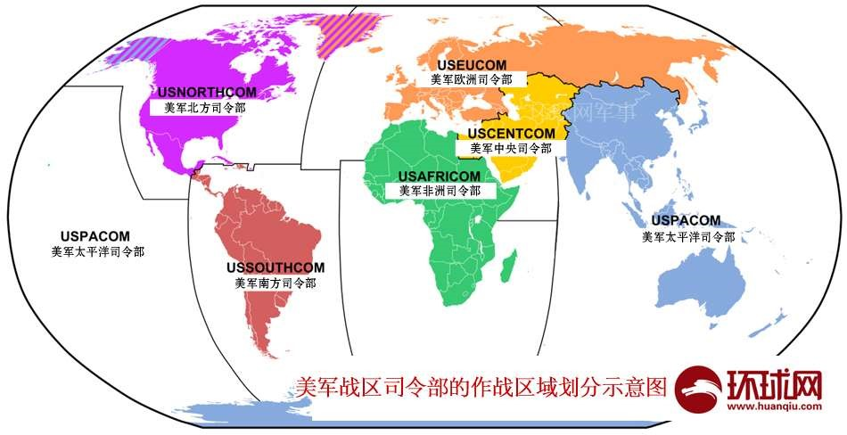

# 古代军事思想

## 定义
古代对于战争和军队问题的一些理性认识  
治兵用兵的原则和方法  
约等于&quot;兵法&quot;

## 中国古代军事思想的发展沿革

1. 顺时而出，萌芽稚嫩的夏商西周军事思想  
战争观念，强调敬天、保民、师出有义  
战争指导，重礼信仁义  
用兵指挥法则，注重阵法应用，车兵与徒兵相结合

2. 长足发展，趋于成熟的春秋战国军事思想  
对战争起源的认识逐步深化，战争的义和不义初步区分  
军事家们进一步要求军事改革、富国强兵，将帅素质逐渐升华  
政治谋略、军事理论、兵战艺术相结合

3. 作战样式多样、新创发展的秦统中国至五代时期军事思想  
高度重视战略谋划，战略运用达到相当水平  
国防指导思想呈现出新特点  
作战指导思想有了新的发展，争夺战争主动权意识进一步加强

4. 继承发展，不断完善的辽宋西夏金至元明清军事思想  
骑战、水战凸显，军事理论和军事技术不断完善  
确立了高度集中兵权的建军宗旨。练兵、练将思想日益规范化、系统化  
战略思想更加丰富系统  
火器的发展和广泛运用促进了作战指导思想的发展

### 《孙子兵法》吴孙子 孙武
### 《孙膑兵法》齐孙子 孙膑 田忌赛马 围魏救赵

## 孙子兵法的影响
世界上最早、流传最广  
被国人极为推崇  
在国外久负盛名

## 《孙子兵法》的主要军事思想
重战慎战和备战的思想  
&quot;知己知彼&quot;战争指导思想  
以谋略至上为核心的用兵思想  
文武兼施，恩威并重的治军思想  
朴素的唯物论和原始的辩证思想

##  局限性
战争观方面未能区分战争性质  
治军方面的愚兵政策  
作战原则尚存有某些片面性和绝对性  
军队补给方面的抢掠政策

# 国防动员

## 国防动员概念（重点）  
国防动员亦称战争动员，是指国家为准备战争和实施战争而在相应范围内由平时状态转入战时状态所采取的，对人力、物力和财力统一调动的紧急措施。

## 功能  
应战功能  
应急功能  
服务功能  
>1. 节约国防开支  
>2. 国防动员建设成果可以直接为经济建设服务  

## 国防动员主要内容（重点）  
### 武装力量动员——核心（重点）  
现役部队动员  
预备役部队动员  
后备兵动员 战时征召适龄公民到部队服现役  
民兵动员  
>民兵 不脱离生产的群众性武装组织 400万
### 国民经济动员  
工业  
财政金融  
医药卫生等  
### 人民防空动员  
### 交通战备动员  
### 政治动员  

## 国防动员实施程序  
进行动员决策 全国人大  
发布动员令 国家主席  
充实动员机构  
修订动员计划  
落实动员计划  

## 国防动员发展趋势  
由单一应战动员向应对多种安全威胁转变  
>1998抗洪抢险  
>2003抗击非典  
>2008汶川救灾  

由维护国家境内安全向维护国家海外利益拓展  
国防动员法规的作用日益明显  
动员的内在要求越来越高  
>精确动员  
>加大科技、信息动员含量  

# 国防法规

## 国防法规的层次

| 法    律 | 全国人民代表大会 全国人大常务委员会 | 国防法律 关于法律问题的决定 |
| --- | --- | --- |
| 法    规 | 国务院 中央军委 | 军事行政法规 军事法规 |
| 规    章 | 国务院有关部委、军委各总部、各军兵种 | 军事行政规章 军事规章 |
| 地方性法规 | 省、自治区、直辖市 人民代表大会 | 补充规定、实施细则 实施办法等 |

## 主要国防法律  
1.《国防法》1997年３月14日  
2.《兵役法》1984年５月31日  
3. 现役军官法  
4. 军官军衔条例  
5. 军事设施保护法  
6. 预备役军官法  
7. 人民防空法  
8. 国防教育法  
9. 香港驻军法  
10. 澳门驻军法  
11. 《刑法》第七章“危害国防利益罪”  
第十章“军人违反职责罪”  
12.《人民武装警察法》2009年8月27日  
13.《国防动员法》2010年2月26日  
14.《军人保险法》2012年4月27日  

## 国防法规的门类
1. 国防基本法类
2. 国防组织法类
3. 兵役法类
4. 军事管理法类
5. 军事刑法类
6. 军事诉讼法类
7. 国防经济法类
8. 国防科技工业法类
9. 国防动员法类
10. 国防教育法类
11. 军人优抚法类
12. 军事设施保护法类
13. 特区驻军法类
14. 紧急状态法类
15. 战争法类
16. 对外军事关系法类。

## 国防法规的特性 
调整对象的军事性  
公开程度的有限性  
法律适用的优先性  
处罚措施的严厉性  

## 士兵军衔（二等九级）
（一）志愿兵士兵：
一二三级军士长  
四级军士长  
上士、中士、下士  
（二）义务兵士兵：上等兵、列兵

## 军官军衔 （三等十级） 
将官：上将中将少将  
校官：大校上校中校少校  
尉官：上尉中尉少尉

## 公民的国防义务（6项）  
接受国防教育  
保护国防设施  
保守国防秘密  
支持国防建设  
协助军事活动  
依法服兵役  

## 公民的国防权利（4项）  
建议权  
制止权  
检举权  
获得补偿权  

### 中华人民共和国实行义务兵与志愿兵相结合、民兵与预备役相结合的兵役制度。

# 海洋权益

18000公里大陆海岸线  
30万平方公里海洋领土  

## 海洋权益内涵  
海洋安全环境  
海洋领土主权  
海洋资源开发  

### 1海里=1.852公里  
### 1节=1海里/小时  

## 海洋权益维护发展历程  
第一阶段：海洋维权等同于维护海防安全——主要以军事手段  
第二阶段：海洋经济利益日益突出——逐步重视法规在海洋维权中的作用  
第三阶段：海洋维权上升到战略高度——纳入国家发展整体布局  

## 海洋维权力量  
中国海监  
中国海事  
中国渔政  
中国海警  
中国海军  
>五大兵种：水面舰艇、海军航空兵、潜艇、岸防兵、海军陆战队  

中国海军是维护海洋权益的坚强柱石  
和平时期世界各国通行做法 海上权益维护大多由准军事力量完成，军队更多时候是他们的坚强后盾  

## 海洋权益维护现状  
海洋意识不足  
周边安全环境恶化  
领土主权争议加深  
海上危机事件增多  

## 对海洋维权的思考  
充分认清国际行为本质  
积极加强军事力量准备  
树立积极主动的危机意识  
1. 应对危机问题  
2. 利用危机问题  
3. 塑造危机问题  

多方合作，共同维护海洋权益  

## 判断题
1. 中国有300万平方公里的海洋国土。（对）
2. 专属经济区的距离为200海里。（对）
3. 越南是唯一对中国南沙群岛、西沙群岛同时提出主权要求的国家。（对）
4. 岛礁主权归属的原则是按照距离远近决定。（错）
5. 中国与马来西亚没有岛礁主权归属争议。（错）

## 单选题
1. 中国最南端的地级市是（C）  
A. 海口 B. 三亚 C. 三沙 D. 南沙  
2. 中国的海岸线长度是（C）  
A. 1万公里 B. 1.5万公里 C. 1.8万公里 D. 3万公里  
3. 中国海军护航编队执行护航任务的区域是在（A）  
A. 亚丁湾 B. 南沙 C. 印度洋 D. 东海  
4. 领海的距离是（B）  
A. 12公里 B. 12海里 C. 200 海里 D. 200公里  
5. 中国海警局成立是在（D）年  
A. 1978 B. 1997 C. 2008 D. 2013  

## 多选题
1. 中国人民解放军海军包括水面舰艇、海军航空兵和（BCD）五大兵种  
A. 航母 B. 潜艇 C. 岸防兵 D. 海军陆战队  
1. 中国人民解放军海军包括水面舰艇、海军航空兵和（BCD）五大兵种  
A. 航母 B. 潜艇 C. 岸防兵 D. 海军陆战队  
3. 中国对于争议岛礁、海区的态度是（ABC）  
A. 主权属我 B. 搁置争议 C. 共同开发 D. 尽早解决  
4. 在南海方向与中国存在领土主权争议的国家包括（ABCD）  
A. 越南 B. 菲律宾 C. 马来西亚 D. 文莱  
5. 与海洋邻国存在领土主权争议的海区包括（BCD）  
A. 渤海 B. 黄海 C. 东海 D. 南海  

# 毛泽东军事思想

## 游击作战十六字诀  
敌进我退，敌驻我扰，敌疲我打，敌退我追  

## 形成和发展  
产生时期 1921年7月 共产党成立到1935年1月 遵义会议  
形成完整科学体系 长征胜利到1945抗日胜利  
继续丰富和发展  

## 毛泽东军事思想的科学含义及基本特征  

### 科学含义  
以毛泽东为主要代表的中共人关于中国革命战争、人民军队和国防建设问题的科学的理论体系。

### 基本特征  
1. 马克思主义基本原理与中国革命战争具体实践相结合的产物  
2. 中国革命战争和军队建设实践经验的总结  
3. 以毛泽东为主要代表的中共人集体智慧的结晶  
4. 是毛泽东思想的重要组成部分  

## 毛泽东军事思想的主要内容  
### 1. 战争观和方法论  
战争指导的核心问题：主观指导与客观实际相结合  
如何实现主观指导与客观实际相结合  
调查研究  
矛盾分析  

### 2. 人民军队建设理论  
党对军队绝对领导原则  
以“为人民服务”的根本宗旨教育部队  
创立了政治工作的三大原则：官兵一致，军民一致，瓦解敌军  

### 3. 人民战争思想  
民众的爱国主义教育  
社会内部的和谐程度  
政府的公信力和号召力  
国民经济动员能力  
民众对战争损失的承受能力  

>含义：是指广大人民群众为反抗阶级压迫或抵御外敌入侵而组织和武装起来进行的战争。  
>基本特征：正义性、群众性

### 4. 人民战争的战略战术  
战略上藐视敌人，战术上重视敌人  
保存自己，消灭敌人  
实行积极防御，反对消极防御  
军事打击与政治斗争的结合  
不拘一格，灵活用兵  

### 5. 国防现代化建设理论  
建立现代化正规化的国防军，抵御外敌入侵  
确立了向国防科技尖端发展的战略  
坚持积极防御的战略方针  
两弹一星  

## 毛泽东军事思想的历史地位  
对马克思军事理论做出了重大的贡献  
对当代世界军事具有重大影响  
永远是我国军建和作战的行动指南  

# 国际战略环境

## 国际战略环境和国际战略格局的概念
>国际战略环境：一定时期内世界各主要国家和政治集团在战略上互相联系，相互作用所形成的世界全局性的大环境  
>国际战略格局（框架结构）： 一定时期内，国际关系中起主导作用的力量之间的相关关系和结构形式——力量 关系 秩序  
>国际战略形势（动态表现）  

## 冷战后的国际战略格局

### 冷战时形成了以美苏两个超级大国为首的两极格局

### 冷战后国际战略局势朝着多极化防线发展，呈现“一超多强”的格局美国 俄罗斯 欧盟 日本 中国（五大力量中心）

1. 美国谋求建立单极世界却难阻多极化潮流
2. 欧盟力量在不断增长却自主意识日趋发展
3. 俄罗斯发挥军事力量的作用力保大国地位
4. 日本加快由经济大国走向政治大国的步伐
5. 中国在国际事务中将发挥越来越大的作用
6. 其他国家和国家集团的实力和地位在增长

## 冷战后国际战略形势发展特点  
冲突热点多  
大国竞争激烈  
非传统安全威胁上升  

1. 国际形势总体趋向缓和，局部地区冲突依然频发  
>大战不打 小战不断  

制约大战发生的主要因素：  
>1. 以联合国为代表的世界和平机制仍在充当稳定制衡  
>2. 核武器仍在发挥威慑作用  
>3. 全球化导致各国下相互依赖不断加强  

2. 美国在欧亚大陆边缘地带布控，重点遏制中俄崛起
3. 非传统安全问题威胁持续上升，世界处于脆弱安全状态

>传统安全：是一政治和军事安全为中心的安全——主权独立，领土完整所面临的外部武力或威胁使用的挑战  
>非传统安全：指的是政治安全和军事安全以外的安全问题，涉及国家的政治，经济，社会，对外关系等各个领域  
金融安全  
能源安全  
粮食安全  

### 1991年海湾战争  
1999年科索沃战争  
2001年阿富汗战争  
2003年伊拉克战争  
2011年利比亚战争  
2014年5月11日顿涅茨克，卢甘斯克公投加入俄联邦  
2014年3月16日克里米亚公投加入俄联邦  
2014年5月25日新当选的乌克兰总统巧克力大王，波罗申科  

# 新中国国防建设

## 1949-1978  
以战备为中心的国防建设  

## 1978-1999  
服从和服务于经济建设的国防建设  
>70年代末 “洋冒进”思想  
>80年代 863计划  
>90年代 引进和自创相结合  

## 2000-
跨向新世纪的军队建设

##
1. 经历时期：一个初创期（夏商周）、五个辉煌期（春秋秦汉唐元）、三段低迷期（魏晋南北朝、两宋、明朝中后期）、百年耻辱期（清朝后期、民国）  
2. 近代中国第一个不平等条约：中英《南京条约》  
3. 新中国国防建设历史成就  
>1.建立起国防和军队领导体制  
>2.形成并坚持正确的国防政策  
>3.诸军兵种合成军队日益强大  
>4.坚决维护了国家安全统一  
>5.国防科技工业实现质的飞跃 

4. 七大军区：北京、沈阳、济南、南京、兰州、成都、广州  
5. 国防政策的主要特征：自卫性、自主性、协调性、人民性、正义性  
6. 国防的含义与国防的基本类型（我国是防御性国防，就是国家为防备和抵抗侵略，制止武装颠覆，保卫国家的主权、统一、领土完整和安全所进行的军事活动，以及与军事有关的政治、经济、外交、科技、教育等方面的活动）  
7. 国家与国防：（1）国防随着国家的产生而出现 (2）国防服务于国家利益  
8. 中国国防力量构成：陆军、空军、海军、二炮部队、民兵、预备役、武警  
9. 中国国防历史对中国国防的几点思考：1）秉承中国历史积淀的国防理念（爱和平、重防御、求统一）2）牢记近代百年耻辱史（政治腐败、经济科技落后、武备松弛、军纪败坏）
3）实现富国强军的统一  
10. 成立时间：陆军1927.8.1 海军1949.4.23 空军1949.11.11 二炮1966.7.1  
11. 国防行为主体是国家，基本内容包括国防建设和国防斗争两个方面  
12. 国防的基本内容：国防建设、国防斗争  

# 周边安全环境

## 南海  
半封闭边缘海  
南北长约3000公里  
东西最宽约1800公里  
面积约350万平方公里  
依据“九段线”  
我国主张管辖面积210多万平方公里  

### “十六字”方针  
“长期稳定、面向未来、睦邻友好、全面合作”  

### “四好”精神  
“好邻居、好朋友、好同志、好伙伴”  

##
邻国数量：陆地邻国14个，海上邻国8个  
邻国共有20个  

世界上100万军队的国家，5个  
中国，美国，俄罗斯，印度，朝鲜  

### 周边地缘环境复杂  
中国是一个陆海大国，面临陆地和海洋两个大的战略方向  

## 中国周边安全环境的威胁挑战  
1. 美国战略重心东移，对我国压力全面增强  
>其一，美国在我国周边的访问交流增多  
>其二，美国在我国周边的兵力数量增多  
>其三，美国在我国周边的军事活动增多  

2. 日本印度外向增强，对我国构成重要挑战  
3. 热点问题此起彼伏，对我国产生诸多牵制  
4. 台湾实现三不政策，使祖国统一长期延迟  

## 中国周边安全环境的战略思考
1. 和平合作发展，提升国家实力
2. 增强国防实力，打赢关键战争

# 美国军事情况

## 美国武装力量  
美国武装力量隶属于美国国防部，由现役部队，后备役部队及文职人员三大部分组成  

### 现役部队  
138.7万人  

>陆军  
现役兵力53.8万人  
主战坦克：M1-A2“艾布拉姆斯”型  

>海军  
1.现役兵力33.3万人。  
2.海军陆战队现役兵力17.5万人  
现役航母数量：10艘(尼米兹系列）  

>空军  
空军现役兵力34.1万人  
B2 战略轰炸机  

>海岸警卫队  
平时由国土安全部指挥。战时，则由国防部通过海军部指挥，共约4万人。  

### 预备役部队96.9万人  
### 文职人员70.9万人  

### 六大战区  
  
①	太平洋总部辖区 主要战区
②	欧洲总部辖区 
③	中央总部辖区
④	北方总部辖区 
⑤	南方总部辖区 
⑥	非洲总部辖区 最晚成立

## 美国现行军事战略（两个时代，九个时期）

1.冷战时代  
①	遏制战略时期（1945-1952）  
②	大规模报复战略时期（1953-1960）  
③	灵活反应战略时期（1961-1968）  
④	现实威慑战略时期（1969~-1980）  
⑤	新灵活反应战略时期（1981-1988）里根 星球大战计划   
2.冷战后时代  
①	地区防务战略时期（1989-1992）  
②	灵活与选择参与战略时期（1993-1996）  
③	“营造、反应 准备”战略时期（1997-2004）   
④	“保卫、防范、战胜战略”时期（2005-2010）小布什提出又叫“先发制人打击”战略  
2011年奥巴马政府提出的是“打赢、慑止、合作、准备”的新军事战略目标。  

### 特点  
（一）突出大国挑战和地区威胁  
（二）确立四大战略目标 打赢、慑止、合作、准备。
>1. 打击暴力极端主义  
>2. 慑止和击败侵略  
>3. 加强国际和地区安全  
>4. 塑造未来部队  

（三）保持以打赢“1+”战争为主的多种军事行动能力  
（四）军事战略重心转向亚太  
>1. 实力配置量多质优，干预水平不断提升  
>2. 基地布局不断优化，支援能力大幅提升  

（五）坚持合作与防范的对华战略  
>1. 密切关注中国军力发展，确保美军全面的绝对优势，增强其威慑能力  
>2. 加强亚太地区战备，确保美军在该地区大规模战争中，能战胜中国军队  

# 日本军事基本情况

## 武装力量  
隶属于防务省  

### 和平宪法  
>第九条 日本国民衷心谋求基于正义与秩序的国际和平，永远放弃以国权发动的战争、武力威胁或武力行使作为解决国际争端的手段，为达到前项目的，不保持陆海空军和其他战争力量，不承认国家的交战权。  

即放弃战争、不维持武力、不拥有宣战权  

### 现役兵力  
24.7万

>陆上自卫队  
15.1万  
10式主战坦克  

>海上自卫队  
4.55万
一个联合舰队（4个88护卫群——8驱逐舰、8反潜直升机、其他舰艇）
宙斯盾战舰
“出云”号轻型航空母舰
P-3C反潜巡逻机（猎户座）
吉布提军事基地 曼德海峡

>航空自卫队  
4.7万  
三大主力战斗机  
1. F-15J重型战斗机  
2. F-2B型支援战斗机  
3. F-4“鬼怪”战斗机  

将购买美国F-35隐形战斗机  

### 文职人员
2.14万
### 预备役
6.07万
快反预备役
一般预备役
候补预备役

## 军事部署  
以西南诸岛方向为防卫重点（应对中朝）  
加强机动作战力量  
海空军主力居中策应（保护中部工业区）  

### 针对中国       
一是成立专门的“岛屿防卫”部队  
并将组建“水陆机动团”（钓鱼岛、台湾）  
二是成立专门监视中国的部队  

## 军事战略  
### “专守防卫”（1970）  
受到侵略时才可以使用力量  
力量行使的程度仅限于自卫  
力量保持的规模限定在能够自卫的程度  

### “联合机动防卫”（2013）攻势防卫  

确保日本领域的绝对安全  
确保日本周边地区的安全  
确保日本在亚太地区乃至全球的安全利益  

1. 强调面临多种威胁，重点防范朝鲜和中国
>朝鲜	
现实中主要威胁  
朝鲜研制核武器和试射导弹，尤其是发射的卫星飞越日本上空问题  
朝鲜特种部队绑架日本人的问题  

>中国 仅次于朝鲜的现实威胁  

>俄罗斯 第三  
俄占北方四岛  
俄战机入侵日本领空  

2. 战略目标的重点转向防患于未然

>战略目标  
一是强化威慑能力，避免和排除对日本的直接威胁  
二是依托同盟伙伴关系，尽早发现和消除对日本的直接威胁  
三是主导全球安全事务谋求更大利益  

3. 强调建设联合机动防卫力量，提高应急作战能力  
>战略原则  
 “多能、灵活、有效”的基础防卫力量—>机动防卫力量—>联合机动防卫力量  
4. 突出日美同盟的核心地位，强化军事同盟关系  

>日美关系面临的三个考验  
第一，冲绳美军普天机场搬迁问题  
第二，反对日本承担主题美军军费  
第三，反对日本为美国撤走提供搬迁费  

>美国在钓鱼岛问题上的立场  
一、在主权归属上不选边站  
二、有义务协助日本保卫钓鱼岛  
三、反对以武力改变现状  

>美日台海演习 联合利剑  
美日钓鱼岛演习 强权夺岛  
