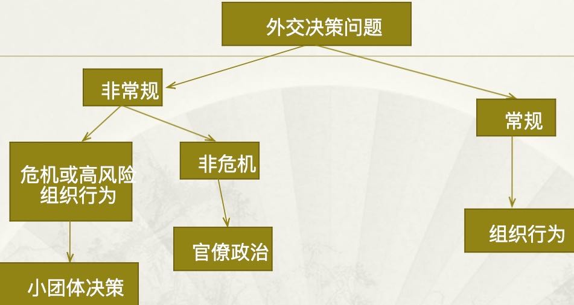

[TOC]

2015-2016第二学期  
  
### 考题范围（实际考题比这个少）  
#### 任选外交事件  
#### 层次分析法进行外交分析  
#### 外交决策类型  
#### 个人发挥作用因素  
#### 分析模式要点  
#### 国内政治影响  
#### 意识形态价值观影响  
#### 小集团特点  
#### 文化影响  
Waijiaojuece@163.com  
Waijiaofenxi  
  
#### 外交决策类型  
民主决策机制  
组织决策机制  
个人决策机制  
  
#### 外交决策的层次  
##### （一）全球层次  
国际体系（结构和进程）  
焦点议题  
第三者行为  
   
##### （二）国家/国内层次  
国家总体的议程  
政治环境  
社会环境  
地方（政府和社会）  
   
##### （三）个人层次  
决策者，包括最高领导人和参与决策的政治精英  
智囊或者贤士  
平民百姓  
  
#### 影响个人发挥作用的因素  
兴趣  
知识背景和个人阅历  
对环境的敏感度  
认知和心理  
宗教信仰  
  
#### 外交决策模式  
  
  
##### 理性选择模式  
作为决策者的国家或政府，被认为是单一的、理性的、有目标的行为体  
决策中的信息传递是充分的、可靠的  
决策者对行动方案进行的评估是客观的，即深入比较各个方案及其后果，从而选择最佳方案进行实施  
  
##### 组织过程/行为/机构模式  
外交事务的行动者是一个松散地联合在一起的组织机构，其最高层是政府领导人  
不同政策领域的责任是由不同的组织机构分担的  
组织机构的运作需要许多人协作作出努力，通过规范的运作程序来完成  
每一个组织机构都试图在推进自己的组织使命、捍卫自己所属的组织的利益，因而各组织之间必然要发生激烈的竞争  
  
##### 官僚/政府政治模式  
来自许多行政机关的人参与其中   但没有一个决策者或机关占有绝对优势地位。  
每一官僚机构都有它自己的利益与使命  
由于没人能够控制整个过程，决定往往只能通过政治交易，建立联合阵线和彼此妥协来完成。最终的决策结果往往取决于各成员的“地位权限”和有效使用这种权限的能力。  
一旦决定做出，也不意味着决策过程就此终结。那些对决定还不太满意的决策者或行政机关仍可以继续“做出安排”，即力图修正或修改这一决定及其实施。  
  
  
##### 小集团模式  
对形势的单一解释  对问题的处理过早下结论  
高估集团的能力和内在优势，对集团以外的人和事怀有偏见  
对集团内的决定文过饰非  
通过自我检查的方式迫使成员保持一致，并力图给人一种毫无争执的表象  
决策通常是由集团内部的一位铁腕人物来加以促进并予以维持的。  
  
#### 国家特性与外交决策  
自然属性  
规模  
自然资源  
地理位置  
人口  
军事能力  
经济科技实力  
政权性质  
●决策机制  
●政治体制  
●社会凝聚力  
●意识形态感召力  
●政府稳定性  
文化  
  
#### 文化对外交决策的影响  
外交政策的内容和目标  
影响决策者并通过决策者影响一个国家的外交政策  
影响对外政策制定的机制和过程  
影响到外交政策执行和实施的方式和手段  使一个国家的外交政策拥有独特的文化和民族特色    

